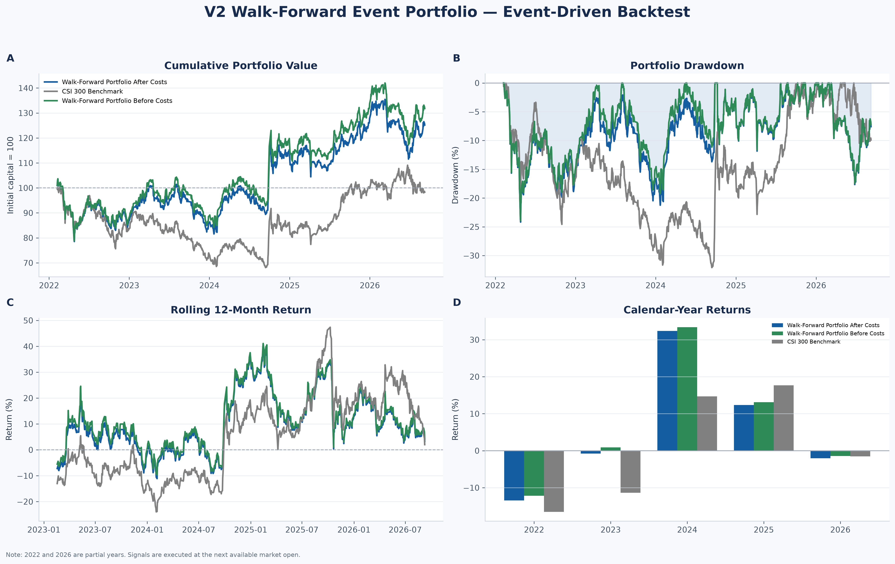
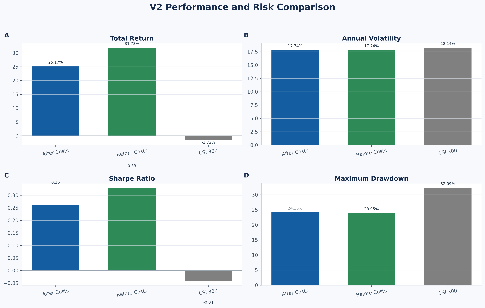
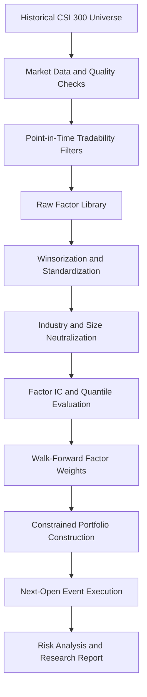
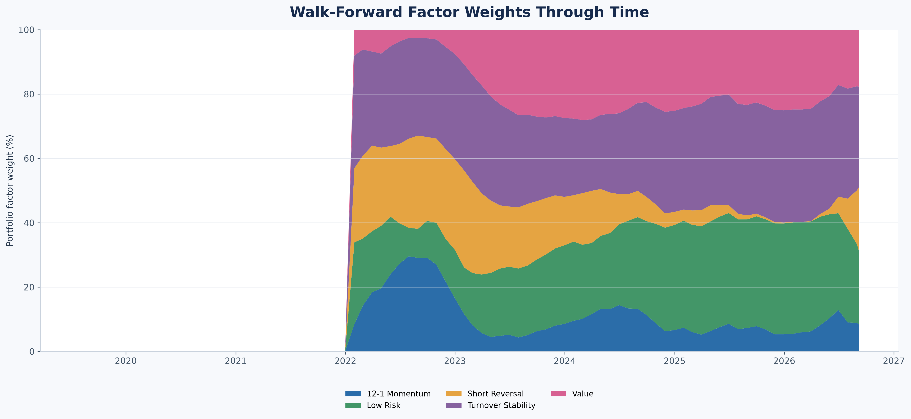
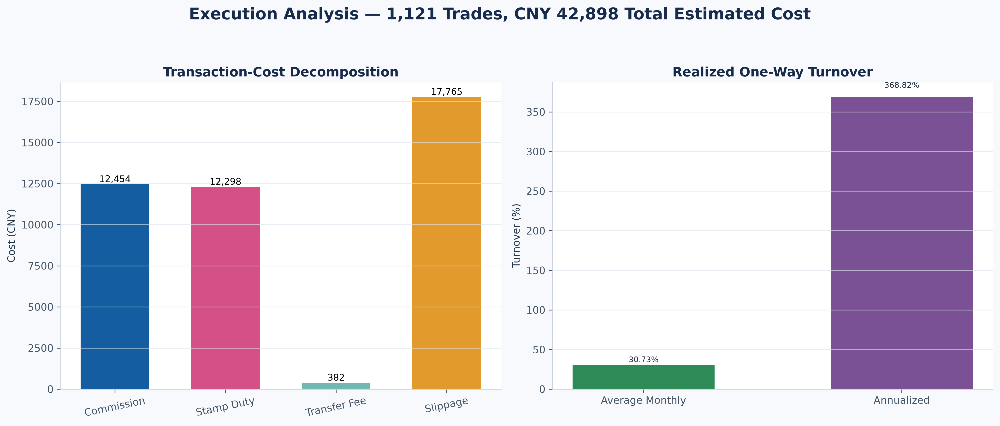

# A-Share Multi-Factor Quantitative Research System V2


An end-to-end quantitative equity research framework for the China A-share market, covering point-in-time universe reconstruction, market-data validation, factor engineering, industry and size neutralization, walk-forward model training, constrained portfolio construction, realistic event-driven backtesting and professional reporting.

> This project is intended for education, research and portfolio demonstration. It is not investment advice.

## Project Highlights

- Reconstructs 94 historical CSI 300 constituent snapshots.
- Retains 520 current and former index constituents to reduce survivorship bias.
- Includes inactive and delisted stocks instead of using only the current universe.
- Processes more than 924,000 daily market observations.
- Applies point-in-time tradability, suspension, ST and history-length filters.
- Builds 17 alpha factors across six factor categories.
- Performs MAD winsorization, cross-sectional standardization and neutralization.
- Evaluates factors using forward returns, rank IC, ICIR and quantile portfolios.
- Trains factor weights using a rolling walk-forward process.
- Constructs a 20-stock portfolio with rank buffers and industry limits.
- Executes trades at the next available open using unadjusted prices.
- Models board lots, commission, minimum commission, stamp duty, transfer fees and slippage.
- Produces risk diagnostics, professional charts, HTML research output and a PDF report.
- Includes automated tests for core data, model, portfolio and execution invariants.

## V2 Backtest Results

Event-driven backtest period: **7 February 2022 to 8 September 2026**

| Metric | Portfolio After Costs | Portfolio Before Costs | CSI 300 |
|---|---:|---:|---:|
| Final value | ¥1,251,689.57 | ¥1,317,757.99 | ¥982,788.04 |
| Total return | 25.17% | 31.78% | -1.72% |
| Annualized return | 5.02% | 6.21% | -0.38% |
| Annualized volatility | 17.74% | 17.74% | 18.15% |
| Sharpe ratio | 0.170 | 0.237 | -0.131 |
| Maximum drawdown | -24.18% | -23.95% | -32.09% |
| Explicit cost / initial capital | 4.29% | 0.00% | 0.00% |

The after-cost portfolio outperformed the CSI 300 by approximately **26.89 percentage points** over the event-backtest period. The strategy also experienced a smaller maximum drawdown than the benchmark, although its absolute Sharpe ratio remains modest.

## Performance Dashboard



## Risk Comparison



## Research Pipeline



## Historical Universe and Data

| Item | Result |
|---|---:|
| Historical CSI 300 snapshots | 94 |
| Current constituents | 300 |
| Unique historical constituents | 520 |
| Former constituents | 220 |
| Inactive or delisted stocks | 11 |
| Daily market-data rows | 924,128 |
| First market date | 2019-01-02 |
| Latest market date | 2026-09-08 |
| Critical data-quality failures | 0 |

The framework keeps former index constituents and inactive securities in the research database. This reduces the survivorship bias that would arise from backtesting the current CSI 300 constituents across the entire historical period.

## Point-in-Time Tradability

Each monthly index snapshot is combined with information available at that time. Securities may be excluded because of:

- Insufficient trading history
- Missing or invalid prices
- Suspension or stale prices
- ST status
- Absence from the historical index snapshot

The tradability module produced:

| Item | Result |
|---|---:|
| Membership observations | 28,200 |
| Eligible observations | 26,084 |
| First usable snapshot | 2019-07-31 |
| Average eligible stocks | 277.5 |
| Latest eligible stocks | 300 |

## Factor Library

The V2 factor library contains the following categories.

| Category | Example Signals |
|---|---|
| Momentum | 20-day, 60-day, 120-day and 12-1 momentum |
| Reversal | 5-day short-term reversal |
| Risk | Volatility, downside volatility and drawdown |
| Trend | Moving-average trend |
| Liquidity | Trading amount, turnover, turnover stability and Amihud liquidity |
| Value | Earnings yield, book-to-price, sales-to-price and cash-flow yield |
| Neutralizer | Log float market capitalization |

### Factor Processing

For each monthly cross-section, the pipeline applies:

1. Missing-value handling
2. Median absolute deviation winsorization
3. Factor-direction alignment
4. Cross-sectional z-score standardization
5. Industry dummy regression
6. Log-float-market-cap neutralization
7. Category-score construction

Post-neutralization diagnostics show approximately zero average size correlation and zero average industry exposure for the processed alpha signals.

## Factor Evaluation

The strongest one-month neutralized signals included:

| Factor | Mean IC | ICIR | Positive IC Rate |
|---|---:|---:|---:|
| Turnover Stability | 0.0291 | 0.3275 | 66.28% |
| 60-Day Downside Volatility | 0.0266 | 0.2027 | 61.63% |
| 20-Day Volatility | 0.0264 | 0.2241 | 60.47% |
| 12-1 Momentum | 0.0225 | 0.1529 | 63.75% |
| Earnings Yield | 0.0196 | 0.1688 | 59.30% |

The 12-1 momentum factor produced the strongest average quintile spread, while short and medium-horizon momentum were less reliable during the sample period.

## Walk-Forward Model

The final model combines five components:

- Turnover Stability
- Low Risk
- Short Reversal
- Value
- 12-1 Momentum

The training framework uses:

- A maximum 36-month rolling training window
- A minimum 24-month history requirement
- Exponentially weighted IC observations
- A maximum component-weight constraint
- Weight smoothing between rebalances
- Strict separation between model-training data and future returns

Reported look-ahead violations: **0**

### Latest Model Weights

| Component | Smoothed Weight |
|---|---:|
| Turnover Stability | 30.94% |
| Low Risk | 22.49% |
| Short Reversal | 20.58% |
| Value | 17.74% |
| 12-1 Momentum | 8.26% |



## Portfolio Construction

The portfolio-construction layer applies the following rules:

- 20 target holdings
- Approximately 5% target weight per stock
- Maximum three holdings from the same industry
- Top-30 entry threshold
- Top-40 exit threshold
- Rank-buffer retention to reduce unnecessary turnover
- Sells processed before buys
- Total target weight limited to 100%

Portfolio-construction validation results:

| Item | Result |
|---|---:|
| Portfolio snapshots | 57 |
| Target holding observations | 1,140 |
| Average holdings | 20 |
| Partial portfolios | 0 |
| Industry-limit violations | 0 |
| Maximum total target weight | 100.00% |
| Average monthly target turnover | 29.82% |

## Event-Driven Execution

The realistic event backtester separates signal formation from execution.

- Signals are formed after the monthly snapshot close.
- Orders are executed at the next available trading-day open.
- Execution uses unadjusted prices.
- Purchases use 100-share board lots.
- Cash cannot become negative.
- Suspended or invalid securities cannot be traded.
- One-price limit-up and limit-down conditions may block execution.
- Available cash is checked before every buy.
- Existing holdings are sold before new positions are purchased.

### Transaction-Cost Assumptions

| Cost | Assumption |
|---|---:|
| Commission | 0.030% |
| Minimum commission | ¥5 |
| Slippage | 0.050% per side |
| Board lot | 100 shares |
| Stamp duty | Applied to sells using date-dependent rates |
| Transfer fee | Date-dependent historical rate |

Execution audit:

| Item | Result |
|---|---:|
| Backtest days | 1,116 |
| Executed trades | 1,121 |
| Blocked trades | 1 |
| Small or cash-limited trades skipped | 351 |
| Negative-cash days | 0 |
| Final holdings | 20 |



## Repository Structure

```text
a_share_quant_project/
├── config/
│   ├── __init__.py
│   └── settings.py
├── data/
│   └── quant_data.db
├── reports/
│   ├── charts/
│   ├── results/
│   └── a_share_multi_factor_research_report_v2.html
├── src/
│   ├── universe.py
│   ├── historical_universe.py
│   ├── baostock_loader.py
│   ├── execution_price_loader_v2.py
│   ├── data_quality.py
│   ├── anomaly_review.py
│   ├── stock_master.py
│   ├── tradability.py
│   ├── factors_v2.py
│   ├── factor_processing_v2.py
│   ├── factor_evaluation_v2.py
│   ├── walk_forward_model_v2.py
│   ├── portfolio_construction_v2.py
│   ├── event_backtester_v2.py
│   ├── performance_diagnostics_v2.py
│   ├── visualization_v2.py
│   └── report_generator_v2.py
├── tests/
│   ├── test_quant_logic.py
│   ├── test_settings.py
│   └── test_v2_pipeline.py
├── A-Share Multi-Factor Research Report V2.pdf
├── main.py
├── requirements.txt
└── README.md
```

## Installation

Clone the repository:

```bash
git clone https://github.com/1216394785-svg/a-share-multi-factor-quant.git
cd a-share-multi-factor-quant
```

Create and activate a virtual environment on Windows:

```powershell
python -m venv .venv
.\.venv\Scripts\Activate.ps1
```

Install dependencies:

```powershell
python -m pip install --upgrade pip
pip install -r requirements.txt
```

## Running the V2 Pipeline

Run the modules from the project root:

```powershell
python -m src.historical_universe
python -m src.baostock_loader --resume
python -m src.data_quality
python -m src.anomaly_review
python -m src.stock_master
python -m src.tradability
python -m src.factors_v2
python -m src.factor_processing_v2
python -m src.factor_evaluation_v2
python -m src.walk_forward_model_v2
python -m src.portfolio_construction_v2
python -m src.execution_price_loader_v2 --resume
python -m src.event_backtester_v2
python -m src.performance_diagnostics_v2
python -m src.visualization_v2
python -m src.report_generator_v2
```

Some data-download steps may take time and depend on the availability of the BaoStock service. Resume mode can safely continue an interrupted download.

## Automated Tests

Run all tests:

```powershell
python -m pytest -v
```

The test suite checks:

- Duplicate stock-date records
- Signal and execution ordering
- Point-in-time universe coverage
- Walk-forward weight constraints
- Portfolio weight totals
- Industry concentration limits
- Board-lot compliance
- Non-negative cash
- Transaction-cost impact
- Drawdown validity
- Research-report generation

Current result: **27 tests passed**

## Research Reports

- [V2 HTML Research Report](reports/a_share_multi_factor_research_report_v2.html)
- [V2 PDF Research Report](A-Share%20Multi-Factor%20Research%20Report%20V2.pdf)

## Main Limitations

- Historical results do not guarantee future performance.
- Daily data cannot reproduce full intraday market microstructure.
- Market impact is simplified and may be larger for institutional capital.
- Historical constituent data may be subject to vendor limitations.
- Factor performance may change across market regimes.
- The model does not currently optimize factor exposure using a full covariance matrix.
- The current framework does not connect to a live brokerage account.

## Potential Future Improvements

- Barra-style risk-model integration
- Factor-covariance estimation
- Volatility-targeted position sizing
- Transaction-cost-aware portfolio optimization
- Alternative rebalance frequencies
- Market-regime detection
- Industry-relative factor models
- Paper-trading and live-data interfaces
- Continuous integration with automated GitHub tests

## Disclaimer

This repository is provided solely for educational and quantitative research purposes. Nothing in this repository constitutes investment advice, a trading recommendation or an offer to buy or sell any financial instrument. Users are responsible for independently verifying all data, assumptions and results.